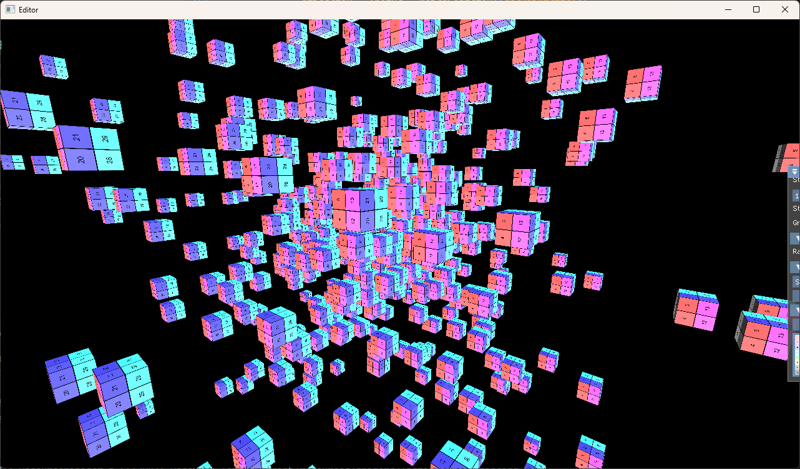
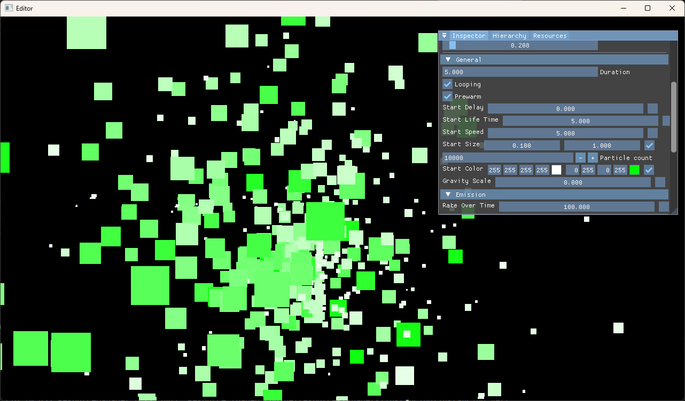
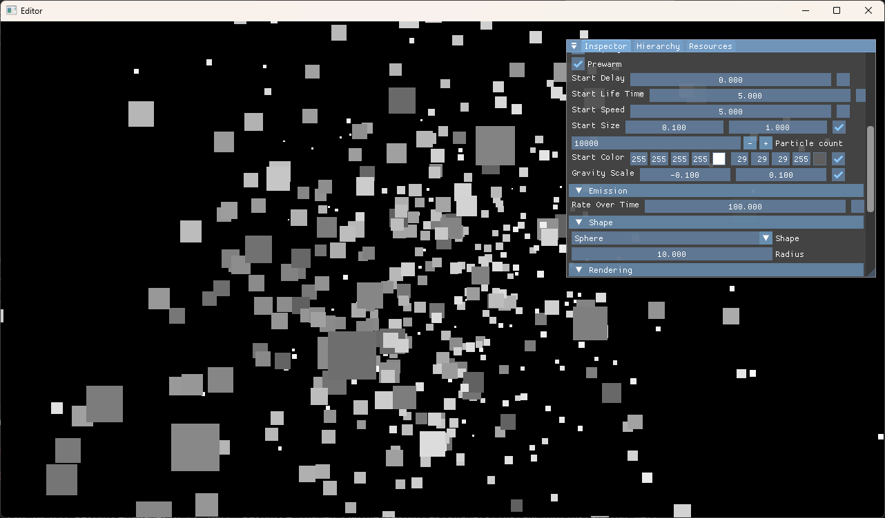
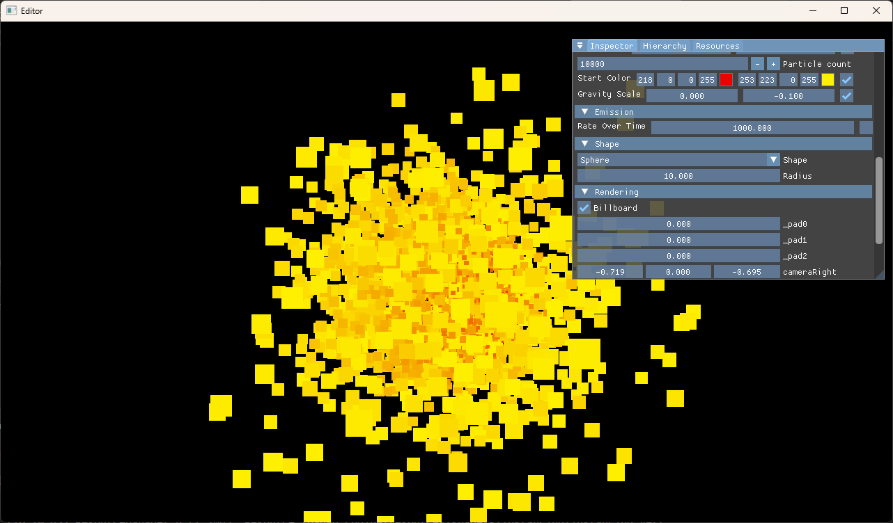
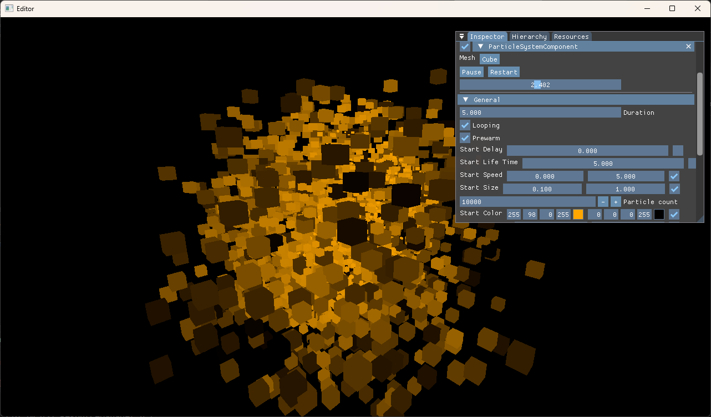

# Vulkan C++ Engine

## Overview

This project is a C++ rendering engine primarily focused on Vulkan.  
It implements:
- Vulkan dynamic rendering
- GPU instancing
- Compute shaders
- A particle system benchmark based on compute shaders

The engine is built as a static library and comes with an editor executable using ImGui.  
The build system is based on **xmake** and supports multi-platform compilation.

## Features

- Vulkan rendering backend
- Dynamic rendering (no traditional render passes)
- GPU instancing
- Compute shader pipeline
- Particle system benchmark (compute-driven)
- ImGui integration

## Requirements

- C++ compiler with C++20 support
- xmake
- Vulkan SDK
- Git

Supported platforms:
- Windows ✅
- Linux ❌
- macOS ❌

## Dependencies (managed by xmake)

- Vulkan SDK
- shaderc
- spirv-reflect
- GLFW
- ImGui (docking branch)
- stb
- galaxymath (custom math library)
- thread-pool

All dependencies are automatically fetched by xmake.

## Build Configuration

By default, the project is configured with:
- Debug and Release modes
- Multi-threading enabled

## Compile the Project

From the project root directory.

### Install xmake

xmake is required to build the project.  
See [xmake.io](https://xmake.io/guide/quick-start.html#installation) for more information.

### Debug build

```bash
xmake f -m debug
xmake
````

### Release build

```bash
xmake f -m release
xmake
```

## Run the Project

The default executable target is the editor.

```bash
xmake run Editor
```

## Generate Visual Studio Solution (Windows)

To generate a Visual Studio `.sln` using xmake:

```bash
xmake project -k vsxmake
```

The solution is automatically kept up to date thanks to the `vsxmake.autoupdate` plugin.

## Project Structure

```
Engine/
  src/        Engine core, Vulkan backend, rendering systems

Editor/
  src/        Editor application using ImGui

xmake.lua     Build configuration
```

## Notes

* Vulkan validation layers are enabled in debug mode when available.
* Shader compilation relies on shaderc.
* The particle system is intended as a compute benchmark.

## Media






